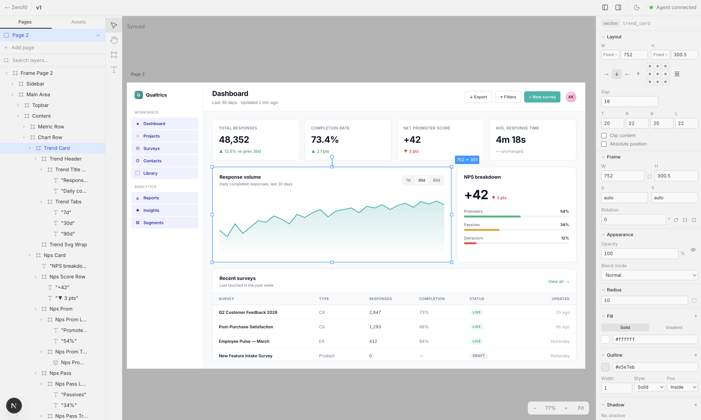

# Zero-10 (z10)

Branchable UI evolution for the agent era.

Zero-10 is a design tool where AI agents edit designs through standard DOM APIs. The `.z10.html` file format annotates plain HTML/CSS with `data-z10-*` attributes and `<script type="application/z10+json">` metadata, so agents can read and write UI natively — no custom SDK, no brittle schema.



*Dashboard built by Claude Code via the [z10 skill](skills/z10/SKILL.md) — sidebar, metric cards, response-trend SVG chart, NPS breakdown, and recent-surveys table. Each component is a reusable `<z10-*>` element with typed props.*

## Getting started

You need three things running: **Postgres**, the **web app** (the canvas + API), and **Claude Code** with the z10 skill installed.

### 1. Start Postgres

```bash
docker run --name z10-pg \
  -e POSTGRES_DB=z10 -e POSTGRES_USER=z10 -e POSTGRES_PASSWORD=z10 \
  -p 5432:5432 -d postgres:16
```

### 2. Start the web app

```bash
cd web
cp .env.example .env.local        # first time only — fill in AUTH_SECRET + OAuth
npm install
npm run db:push                   # first time only — apply schema
npm run dev                       # http://localhost:3000
```

Then:

1. Open `http://localhost:3000` and sign in with GitHub or Google.
2. From the dashboard, click **New project** and open it in the editor.
3. Go back to the dashboard, click **Settings** in the header (`/dashboard/settings`).
4. Under **API Keys**, click **Create API Key**, give it a name, and copy the token shown in the dialog. **The full token is only displayed once** — if you lose it, delete the key and create a new one. You'll use this token in the next step.

### 3. Point the CLI at the web app

The z10 CLI talks to the web app's REST API:

```bash
npm install -g .                                           # from the repo root, installs the `z10` binary
z10 login --token <your-api-token> --server http://localhost:3000
z10 project list                                           # confirms it works
z10 project load <project-id>
```

### 4. Use the z10 skill from Claude Code

The skill lives at [`skills/z10/`](skills/z10). Add it to Claude Code so the agent can design for you:

```bash
# Option A — run Claude with the skill
claude

# Then in chat:
/z10 build a qualtrics-style dashboard on page 2
```

The skill wraps the CLI (`z10 project load`, `z10 dom`, `z10 exec`, `z10 component …`, `z10 tokens`) so the agent has a minimal DOM-style surface: `document.createElement`, `document.getElementById`, `element.style.*`, `element.setAttribute`, etc. Edits land in the canonical DOM on the server and stream into the browser canvas in real time.

## What the agent can do

- **Create / mutate nodes** — `document.createElement`, `appendChild`, `setAttribute`, `style.*`, `textContent`, `innerHTML`
- **Query** — `document.getElementById` (also matches `data-z10-id`), `querySelector`, `querySelectorAll`
- **Define components** — `z10 component create <Name>` with props, variants, styles, and a `{{placeholder}}` template
- **Instantiate components** — set `data-z10-component="Name"` + `data-z10-props='{...}'` on any element
- **Set design tokens** — `z10 tokens` or `z10.setTokens('semantic', {...})`

See the skill ([`skills/z10/SKILL.md`](skills/z10/SKILL.md)) and the [HTML authoring guide](skills/z10/docs/html-authoring-guide.md) for patterns the agent is trained on.

## Project layout

```
.
├── src/                  # z10 core library + CLI + MCP server
│   ├── core/             # Z10Document model, commands, config
│   ├── dom/              # canonical DOM engine, transactions, patches, proxy
│   ├── format/           # .z10.html parser + serializer
│   ├── export/           # React / Vue / Svelte / Web Components codegen
│   ├── mcp/              # MCP tool definitions + HTTP server
│   └── cli/              # `z10` CLI (login, project, page, exec, component, …)
├── web/                  # Next.js 16 editor + REST API + auth + Stripe
├── skills/z10/           # Claude Code skill — how the agent uses z10
└── docs/images/          # screenshots used in this README
```

## Dev commands

```bash
# Library + CLI
npm run build            # tsc
npm run dev              # tsc --watch
npm test                 # vitest

# Web app
cd web
npm run dev              # next dev
npm run db:push          # drizzle schema sync
npm run db:studio        # drizzle-kit studio
```

## Design branches

`.z10.html` files are just HTML, so they version cleanly in Git. The CLI wraps the Git workflow:

```bash
z10 branch "dark-mode-exploration"           # creates z10/dark-mode-exploration
z10 diff main..z10/dark-mode-exploration     # semantic, node-level diff
z10 merge dark-mode-exploration --into main
```

## Code export

Turn any page (or subtree) into a real framework component:

```bash
z10 export my-app.z10.html --format react --id dashboard --out Dashboard.tsx
z10 export my-app.z10.html --format vue
z10 export my-app.z10.html --format svelte
z10 export my-app.z10.html --format web-components
```

Tailwind utilities are used where they map cleanly; the rest falls back to inline styles. Design tokens emit as a `:root { --var: value }` CSS block.

## Governance

Three levels control what the agent may edit, set via `z10 config <file> governance <level>`:

- **full-edit** (default) — agent writes directly
- **scoped-edit** — agent can only edit nodes marked `data-z10-agent-editable="true"`
- **propose-approve** — agent writes to a staging branch; the designer accepts per change

## License

MIT
